# Superspec Phases — Visual Flowchart

High-level pipeline view of the six phases a Superspec change moves through, with explicit ownership marked at each step. Companion to [`docs/workflow-details.md`](workflow-details.md), which expands the same phases into ten concrete steps.

---

## Legend

| Icon  | Meaning                                                                                            |
| ----- | -------------------------------------------------------------------------------------------------- |
| ⚡    | **Superpowers** skill or step (`obra/superpowers`)                                                  |
| 📋    | **OpenSpec** artifact, command, or step (`Fission-AI/OpenSpec`)                                    |
| ⚡📋 | **Hybrid** phase — both systems contribute, OpenSpec orchestrates                                  |

---

## Flowchart

```mermaid
flowchart TD
    classDef sp      fill:#fef3c7,stroke:#f59e0b,stroke-width:2px,color:#92400e
    classDef os      fill:#dbeafe,stroke:#3b82f6,stroke-width:2px,color:#1e3a8a
    classDef hybrid  fill:#ede9fe,stroke:#8b5cf6,stroke-width:2px,color:#5b21b6
    classDef terminal fill:#dcfce7,stroke:#16a34a,stroke-width:2px,color:#14532d

    Start(["💡 Idea / change request"]):::terminal --> P1

    %% ---------- Phase 1 ----------
    subgraph P1[" ⚡ &nbsp;Phase 1 · Brainstorm &nbsp;<code>/opsx:brainstorm</code> "]
        direction TB
        P1a["⚡ <b>superpowers:brainstorming</b><br/>Explore context · ask clarifying<br/>questions · propose 2–3 approaches<br/>with trade-offs"]
        P1b[/"📄 brainstorm.md"/]
        P1a --> P1b
    end
    class P1 sp

    P1 --> P2

    %% ---------- Phase 2 ----------
    subgraph P2[" ⚡📋 &nbsp;Phase 2 · Artifact Creation &nbsp;<code>/opsx:continue</code> "]
        direction TB
        P2a["📋 <b>proposal</b><br/>Change boundary: <i>why · what changes ·<br/>capabilities · impact</i>"]
        P2b["📋 <b>design</b> &nbsp;<i>(optional)</i><br/>Architecture &amp; rationale ·<br/>context · goals · decisions · risks"]
        P2c["📋 <b>specs</b> · delta requirements<br/>ADDED / MODIFIED / REMOVED / RENAMED<br/>SHALL/MUST + <code>#### Scenario:</code> blocks"]
        P2d["📋 <b>tasks</b><br/>Coarse <code>- [ ]</code> checklist,<br/>grouped &amp; ordered"]
        P2e["⚡ <b>superpowers:writing-plans</b><br/>2–5 min TDD micro-steps ·<br/>file paths · snippets · commit points"]
        P2a --> P2b --> P2c --> P2d --> P2e
    end
    class P2 hybrid

    P2 --> P3

    %% ---------- Phase 3 ----------
    subgraph P3[" ⚡ &nbsp;Phase 3 · Code Implementation &nbsp;<code>/opsx:apply</code> "]
        direction TB
        P3a["⚡ <b>using-git-worktrees</b><br/>Isolated <code>.worktrees/&lt;name&gt;/</code><br/>+ clean test baseline"]
        P3b["⚡ <b>subagent-driven-development</b><br/>One fresh subagent per micro-task"]
        P3c["⚡ <b>test-driven-development</b><br/>RED → GREEN → REFACTOR"]
        P3d["⚡ <b>requesting-code-review</b><br/>Per-task review + final review<br/>Tasks flip <code>- [ ]</code> → <code>- [x]</code>"]
        P3a --> P3b --> P3c --> P3d
    end
    class P3 sp

    P3 --> P4

    %% ---------- Phase 4 ----------
    subgraph P4[" 📋 &nbsp;Phase 4 · Spec Validation &nbsp;<code>/opsx:verify</code> "]
        direction TB
        P4a["📋 <b>5 verification checks</b><br/>① <code>openspec validate --all</code> &nbsp;PASS<br/>② all tasks checked<br/>③ delta specs synced<br/>④ design ↔ specs coherent<br/>⑤ clean working tree"]
        P4b[/"📄 verify.md"/]
        P4a --> P4b
    end
    class P4 os

    P4 --> P5

    %% ---------- Phase 5 ----------
    subgraph P5[" ⚡ &nbsp;Phase 5 · Finalization &nbsp;<code>/opsx:continue</code> → <code>finalize</code> "]
        direction TB
        P5a["⚡ <b>finishing-a-development-branch</b><br/>Merge · PR · worktree teardown"]
        P5b[/"📄 finalize.md"/]
        P5a --> P5b
    end
    class P5 sp

    P5 --> P6

    %% ---------- Phase 6 ----------
    subgraph P6[" 📋 &nbsp;Phase 6 · Archival &nbsp;<code>/opsx:archive</code> "]
        direction TB
        P6a["📋 <b><code>openspec archive</code></b> <i>(invoked by <code>/opsx:archive</code>)</i><br/>Apply deltas to <code>openspec/specs/</code><br/>order: RENAMED → REMOVED → MODIFIED → ADDED<br/>Move change → archive/"]
    end
    class P6 os

    P6 --> Done(["✅ Shipped &amp; archived · specs in sync"]):::terminal
```

---

## Phase summary

| # | Phase                | Owner   | Key skills / commands                                                                                                                | Key artifacts                                          |
| - | -------------------- | ------- | ------------------------------------------------------------------------------------------------------------------------------------ | ------------------------------------------------------ |
| 1 | Brainstorm           | ⚡      | `/opsx:brainstorm` · `superpowers:brainstorming`                                                                                     | `brainstorm.md`                                        |
| 2 | Artifact Creation    | ⚡📋   | `/opsx:continue` · `superpowers:writing-plans`                                                                                       | `proposal.md` · `design.md` · `specs/*/spec.md` · `tasks.md` · `plan.md` |
| 3 | Code Implementation  | ⚡      | `using-git-worktrees` · `subagent-driven-development` · `test-driven-development` · `requesting-code-review`                         | Code, tests, commits in `.worktrees/<name>/`           |
| 4 | Spec Validation      | 📋      | `/opsx:verify`                                                                                                                       | `verify.md`                                            |
| 5 | Finalization         | ⚡      | `/opsx:continue` → `finalize` · `superpowers:finishing-a-development-branch`                                                         | `finalize.md` (git closeout receipt) · optional `retrospective.md` |
| 6 | Archival             | 📋      | `/opsx:archive` · `openspec archive`                                                                                                 | Updated `openspec/specs/` · archived change directory   |

---

## See also

- [`docs/workflow.md`](workflow.md) — visual overview and quick mental model
- [`docs/workflow-details.md`](workflow-details.md) — phase-by-phase walkthrough with the ten concrete steps and per-step rationale
- [`openspec/schemas/superspec/INTEGRATION.md`](../openspec/schemas/superspec/INTEGRATION.md) — full lifecycle and CLI cheat sheet
- [`openspec/schemas/superspec/schema.yaml`](../openspec/schemas/superspec/schema.yaml) — machine-readable definition that drives the pipeline
