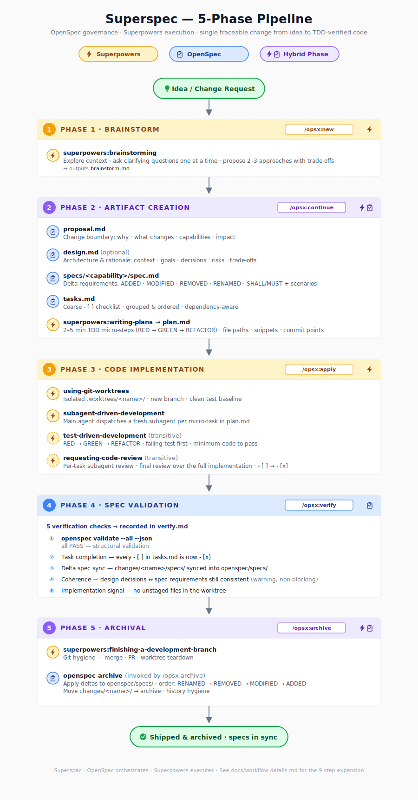

# Superspec Workflow

A Superspec change moves through six phases. OpenSpec governs the artifacts and lifecycle; Superpowers supplies the execution discipline for brainstorming, planning, TDD, review, and branch cleanup.

Use this page as the quick mental model. For the full ten-step rationale, see [workflow details](workflow-details.md).

## At a Glance

| Phase | # | Step | Brief why | Owner |
|---|---:|---|---|---|
| **1. Brainstorm** | 1 | `brainstorm` | Avoid building the wrong thing. | Superpowers |
| **2. Artifact Creation** | 2 | `proposal` | Define the change boundary. | OpenSpec |
| | 3 | `design` *(optional)* | Explain the chosen solution. | Hybrid |
| | 4 | `specs` | Create the testable contract. | OpenSpec |
| | 5 | `tasks` | Scope the work. | OpenSpec |
| | 6 | `plan` | Make the work executable. | Superpowers |
| **3. Code Implementation** | 7 | `apply` | Change the system. | Superpowers |
| **4. Spec Validation** | 8 | `verify` | Prove it matches intent. | OpenSpec |
| **5. Finalization** | 9 | `finalize` | Close out the git side cleanly before archive. | Superpowers |
| **6. Archival** | 10 | `archive` boundary | Sync deltas and freeze the change. | OpenSpec |

## Phase Summary

### 1. Brainstorm

`/opsx:new` starts with Superpowers brainstorming. The goal is to clarify the idea, constraints, alternatives, and trade-offs before OpenSpec artifacts turn the change into a contract.

Primary output: `brainstorm.md`.

### 2. Artifact Creation

OpenSpec turns the brainstorm into governed artifacts: `proposal.md`, optional `design.md`, capability delta specs, and `tasks.md`. Superspec then invokes Superpowers planning to turn the coarse checklist into executable TDD micro-steps in `plan.md`.

Primary outputs: `proposal.md`, `design.md`, `specs/*/spec.md`, `tasks.md`, `plan.md`.

### 3. Code Implementation

Implementation runs through the Superpowers execution loop: isolated worktree, subagent-driven development, TDD, code review, and task checkbox updates. At the end of the phase, an `apply.md` receipt is written so the DAG can gate `verify` on apply having completed.

Primary outputs: code, tests, commits, completed `tasks.md` checkboxes, and `apply.md` (the minimal completion receipt).

### 4. Spec Validation

OpenSpec verifies the completed implementation against the proposal, specs, design, tasks, and working tree state. This catches drift between the intended behavior and what actually shipped.

Primary output: `verify.md`.

### 5. Finalization

The `finalize` artifact (introduced in v3) is reached via `/opsx:continue` after verify reports PASS. Its instruction invokes `superpowers:finishing-a-development-branch` — which presents merge / PR / keep / discard options — and writes `finalize.md` recording the outcome. The recommended retrospective lives here as well, before archive.

Primary outputs: `finalize.md` (the closeout receipt); optional `retrospective.md`.

### 6. Archival

`/opsx:archive` syncs the change's delta specs into the living `openspec/specs/` tree and moves the change directory into the archive. It does not merge git branches; in the canonical PR-review golden path, `/opsx:archive` runs on the feature branch BEFORE the PR merges, so the archive commits land in the PR for a unified review.

Primary outputs: updated living specs and an archived change directory.

## See Also

- [Workflow details](workflow-details.md) — full phase-by-phase guide with per-step rationale
- [README](../README.md) — install and quick start
- [`openspec/schemas/superspec/INTEGRATION.md`](../openspec/schemas/superspec/INTEGRATION.md) — CLI cheat sheet, lifecycle, and design-choice rationale
- [`openspec/schemas/superspec/schema.yaml`](../openspec/schemas/superspec/schema.yaml) — machine-readable workflow definition
